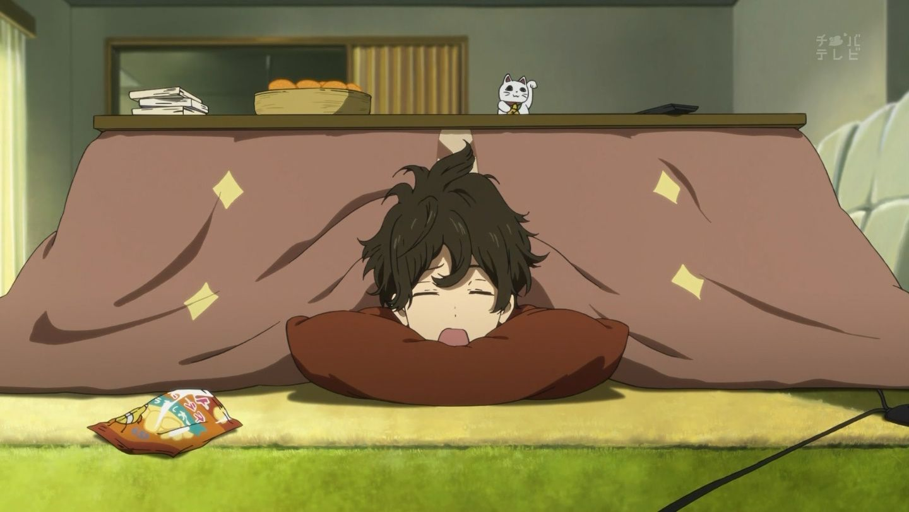

<head>

</head>
<body>

![Modern C++ template][github-sub-title:img]

 
 
 

<<<<<<< HEAD
=======

>>>>>>> 94c738253a0ec079a60a0cc266baebd9cf018dfa

## 欢迎参观 ~~摸鱼王~~ 咸鱼王🐟的主页！！

  
  

[github-sub-title:img]: https://readme-typing-svg.herokuapp.com?font=Segoe+Script&center=true&lines=saltyfish88.
<<<<<<< HEAD
</body>
=======
>>>>>>> 94c738253a0ec079a60a0cc266baebd9cf018dfa
