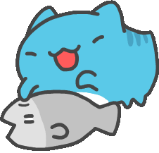
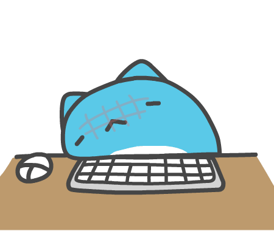

<body>

![Modern C++ template][github-sub-title:img]

 
 
 

## 欢迎参观 ~~摸鱼王~~ 咸鱼王🐟的主页！！

  
  

[github-sub-title:img]: https://readme-typing-svg.herokuapp.com?font=Segoe+Script&center=true&lines=saltyfish88.
</body>